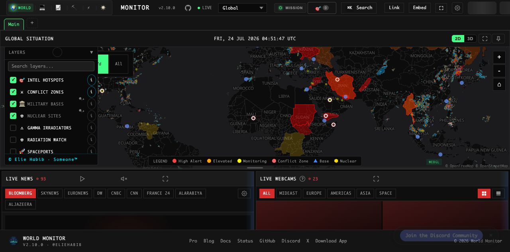

# imzenreally Unraid Community Applications

Community Applications metadata maintained by [imzenreally](https://github.com/imzenreally).

## World Monitor AIO

**World Monitor AIO** is an unofficial, all-in-one Unraid package for [World Monitor](https://github.com/koala73/worldmonitor), a real-time global intelligence dashboard.

The container includes:

- World Monitor frontend
- Local Node API
- Authenticated Redis cache
- Loopback-only Redis REST adapter
- Optional loopback-only AIS relay
- Scheduled data seeders

Only the dashboard HTTP port is published. It does not require privileged mode, host networking, the Docker socket, host devices, or access to Unraid storage outside its dedicated appdata directory.



### Beta status

This listing is prepared for manual Unraid testing and has **not yet been submitted to Community Applications**. The first published image is expected at:

```text
ghcr.io/imzenreally/worldmonitor-unraid-aio:beta
```

Complete source, build workflow, tests, security notes, and the manual installation guide:

- [World Monitor AIO source](https://github.com/imzenreally/worldmonitor-unraid-aio)
- [Unraid installation and operations guide](https://github.com/imzenreally/worldmonitor-unraid-aio/blob/main/docs/UNRAID.md)
- [Packaging support](https://github.com/imzenreally/worldmonitor-unraid-aio/issues)

### Important security note

World Monitor does not provide built-in user authentication. Keep it accessible only on a trusted LAN or VPN unless it is protected by an authenticated reverse proxy. Do not expose its HTTP port directly to the public internet.

### Persistent data

The template maps one dedicated appdata directory to `/config`. It contains generated internal credentials, Redis data, and seeder state. No API key is required to start; optional integrations are available as masked Advanced variables.

### License

The template metadata in this repository is MIT licensed. World Monitor and the derivative AIO image are distributed under AGPL-3.0-only; complete corresponding source is available in the source repository above. This package is not affiliated with or endorsed by the upstream World Monitor maintainer.
