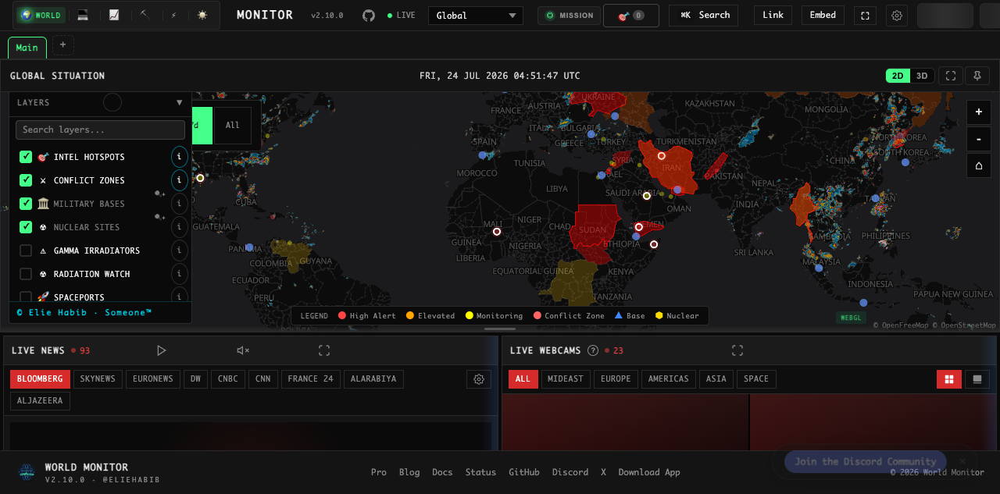

# imzenreally Unraid Community Applications

Community Applications templates maintained by [imzenreally](https://github.com/imzenreally).

## Available applications

- [OpenWebRX+](#openwebrx)
- [World Monitor AIO](#world-monitor-aio)

## OpenWebRX+

**OpenWebRX+** is an actively maintained, browser-based, multi-user software-defined radio receiver. The template packages the upstream [`slechev/openwebrxplus-softmbe`](https://hub.docker.com/r/slechev/openwebrxplus-softmbe) image without rebuilding it.

Features include:

- Live spectrum and waterfall in a modern browser
- Browser audio, tuning, scanning, bookmarks, and recording
- AM, FM, SSB, CW, and other analog modes
- Digital decoders supported by OpenWebRX+
- SoftMBE digital voice support for DMR, D-Star, YSF, NXDN, FreeDV, and DRM
- Support for multiple SDR families through native drivers and SoapySDR

### OpenWebRX+ defaults

| Setting | Default |
|---|---|
| Container image | `slechev/openwebrxplus-softmbe:latest` |
| Web interface | Host port `8073` to container port `8073` |
| Configuration | `/mnt/user/appdata/openwebrxplus/etc` to `/etc/openwebrx` |
| Application data | `/mnt/user/appdata/openwebrxplus/var` to `/var/lib/openwebrx` |
| USB access | `/dev/bus/usb` |
| Temporary files | In-memory `/tmp` tmpfs |
| Privileged mode | Disabled |
| Network mode | Bridge |

The installer requires an administrator password. The container creates the configured administrator account on first start if it does not already exist.

### OpenWebRX+ hardware and security notes

A physical SDR normally cannot be opened by two containers at once. Stop any ADS-B, radio, or feeder container using the dongle before assigning it to OpenWebRX+, or connect a second SDR dedicated to OpenWebRX+.

The default template passes the complete `/dev/bus/usb` tree because USB bus and device numbers can change after reconnection or reboot. This is broader than mapping one stable device path. Network SDRs may not need the USB mapping.

Keep the receiver on a trusted LAN or VPN unless you intentionally configure accounts, HTTPS, and a hardened reverse proxy for public multi-user access.

Template support: [repository issues](https://github.com/imzenreally/unraid-community-apps/issues)

Upstream resources:

- [OpenWebRX+ source](https://github.com/luarvique/openwebrx)
- [Container image builder](https://github.com/0xAF/openwebrxplus-docker-builder)
- [Docker Hub image](https://hub.docker.com/r/slechev/openwebrxplus-softmbe)

## World Monitor AIO

**World Monitor AIO** is an unofficial, all-in-one Unraid package for [World Monitor](https://github.com/koala73/worldmonitor), a real-time global intelligence dashboard.

The container includes:

- World Monitor frontend
- Local Node API
- Authenticated Valkey cache
- Loopback-only Redis-compatible REST adapter
- Optional loopback-only AIS relay
- Scheduled data seeders

Only the dashboard HTTP port is published. It does not require privileged mode, host networking, the Docker socket, host devices, or access to Unraid storage outside its dedicated appdata directory.



### Beta status

This listing has passed manual runtime testing and has been submitted to Community Applications for review. The beta image is published at:

```text
ghcr.io/imzenreally/worldmonitor-unraid-aio:beta
```

Complete source, build workflow, tests, security notes, and the manual installation guide:

- [World Monitor AIO source](https://github.com/imzenreally/worldmonitor-unraid-aio)
- [Unraid installation and operations guide](https://github.com/imzenreally/worldmonitor-unraid-aio/blob/main/docs/UNRAID.md)
- [Getting third-party API keys](https://github.com/imzenreally/worldmonitor-unraid-aio/blob/main/docs/UNRAID_API_KEYS.md)
- [Packaging support](https://github.com/imzenreally/worldmonitor-unraid-aio/issues)

### Important security note

World Monitor does not provide built-in user authentication. Keep it accessible only on a trusted LAN or VPN unless it is protected by an authenticated reverse proxy. Do not expose its HTTP port directly to the public internet.

### Persistent data

The template maps one dedicated appdata directory to `/config`. It contains generated internal credentials, Valkey data, and seeder state. No API key is required to start; optional integrations are available as masked Advanced variables.

## Validation

Run the repository validator before committing:

```bash
python3 scripts/validate.py
```

GitHub Actions runs the same validation on every push and pull request.

## License

The template metadata in this repository is MIT licensed. OpenWebRX+, SoftMBE, World Monitor, and the packaged container images retain their respective upstream licenses. World Monitor and its derivative AIO image are distributed under AGPL-3.0-only; complete corresponding source is linked above.
